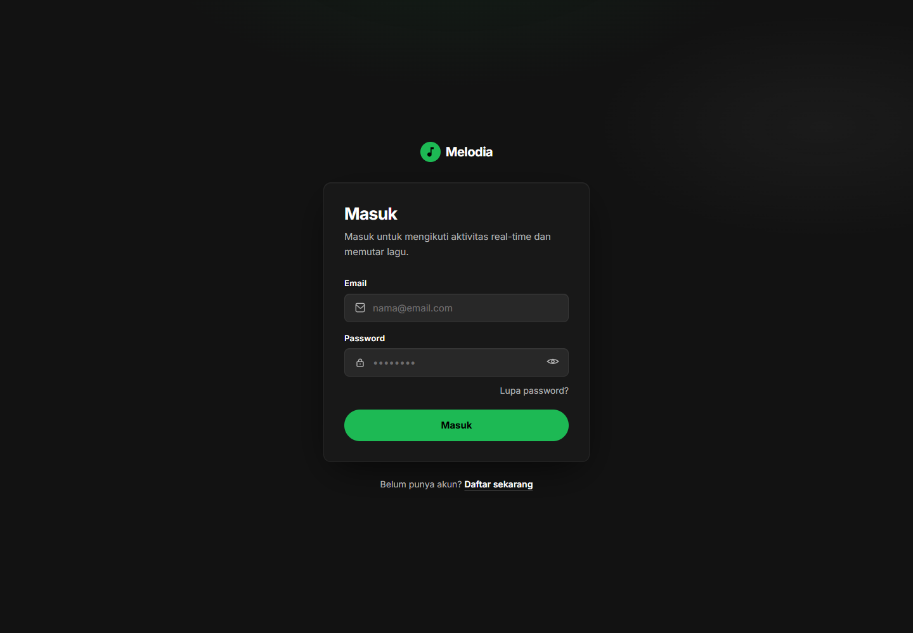
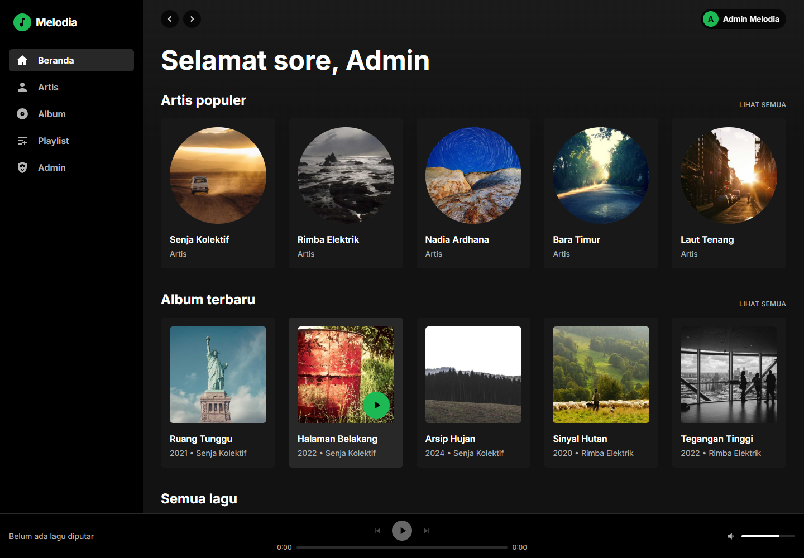
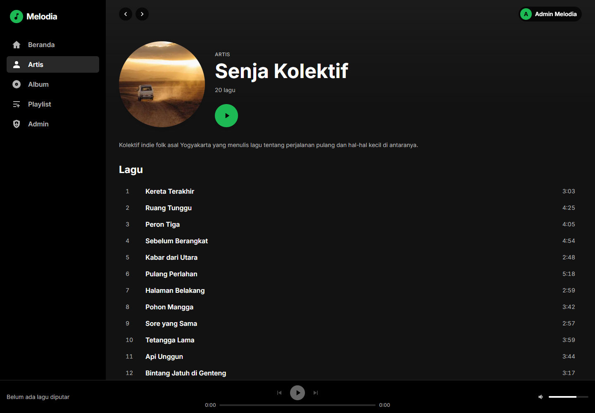
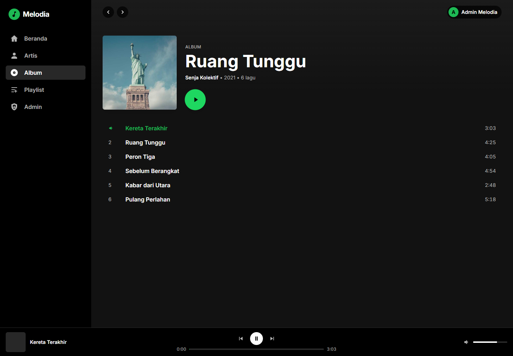
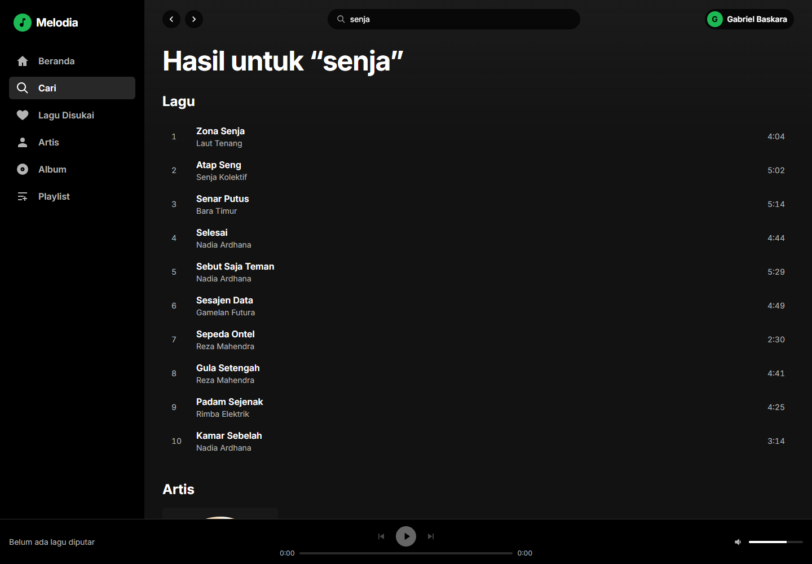
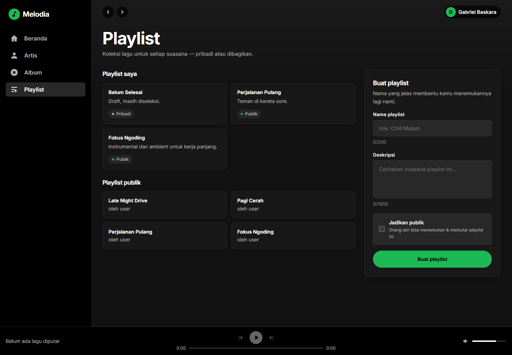
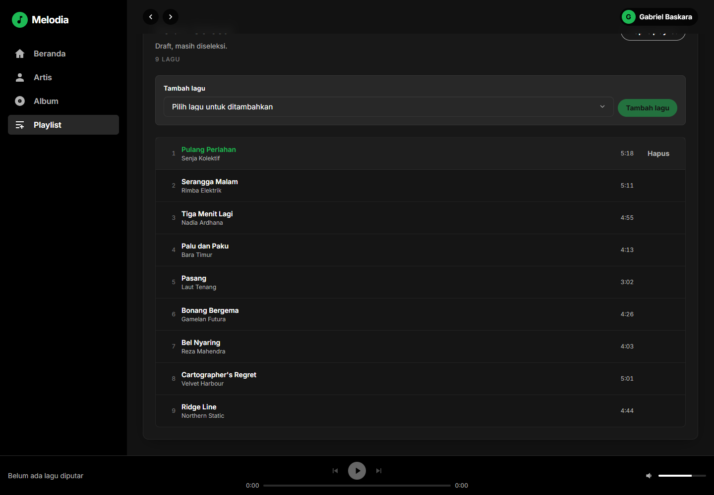
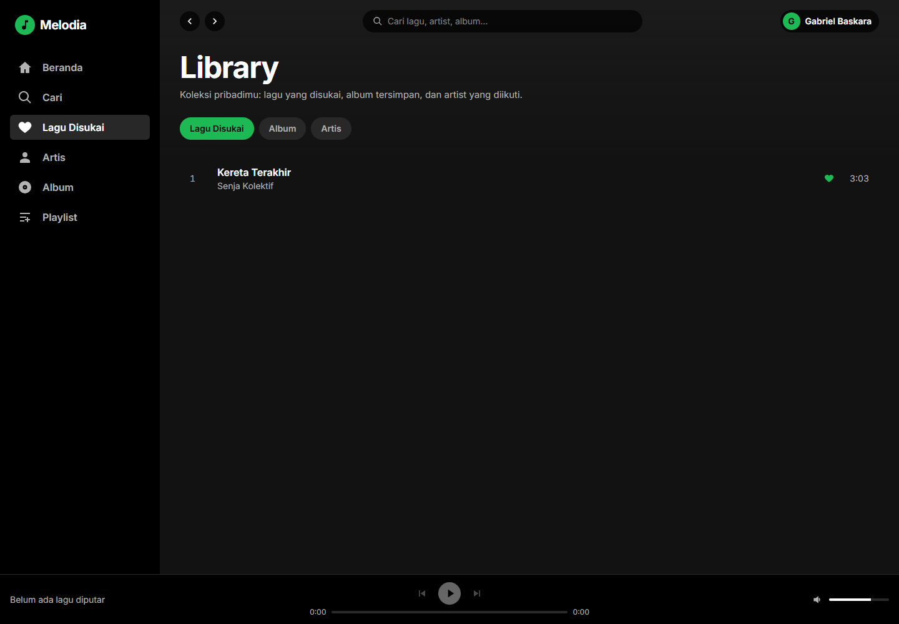
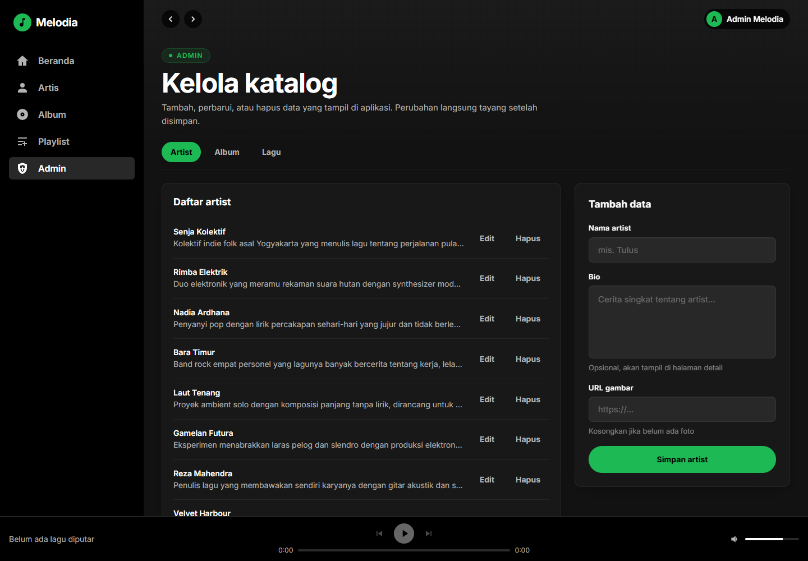

# Spotify Clone — Frontend

Aplikasi web streaming musik yang mengonsumsi REST + WebSocket API dari
backend Go. Proyek portofolio dengan fokus pada pengalaman pemakaian ala
Spotify: katalog, pemutar lagu, playlist, dan dashboard admin — dirakit tanpa
UI kit, seluruh tampilan ditulis dengan Tailwind CSS.

Nama yang tampil di UI adalah **Melodia** — identitas visual sendiri, sengaja
bukan memakai logo/nama pihak lain.

> **Backend:** https://github.com/Tano11933/spotify-backend
>
> Frontend ini tidak bisa berdiri sendiri. Semua data (katalog, user,
> playlist) dan event real-time berasal dari repo backend tersebut — jalankan
> dulu sebelum `npm run dev`.

## Tech Stack

| Komponen | Pilihan |
|---|---|
| Framework | React 19 + TypeScript 6 |
| Build tool | Vite 8, **React Compiler** aktif |
| Styling | Tailwind CSS 4 (CSS-first `@theme`, tanpa file config JS) |
| Routing | React Router 8 (`react-router`, bukan `react-router-dom`) |
| State management | Zustand 5 — `authStore`, `playerStore`, `toastStore` |
| HTTP client | Axios — interceptor JWT + auto-refresh (single-flight) |
| Form & validasi | React Hook Form + Zod |
| Lint | oxlint |
| Font | Inter lewat `@fontsource` (self-hosted, tanpa request ke Google) |

## Fitur

### Autentikasi

- **Login, Register, Lupa Password, Reset Password** — semua divalidasi Zod
  (pesan error berbahasa Indonesia), dengan halaman reset yang dibuka dari
  tautan email.
- **Sesi bertahan saat refresh**: access token disimpan di memori (tidak di
  localStorage), refresh token di localStorage; saat aplikasi dibuka, refresh
  token ditukar lebih dulu baru `GET /api/auth/me` — tanpa request 401 yang
  tidak perlu.
- **Auto-refresh 401**: interceptor Axios menukar refresh token lalu mengulang
  request yang gagal. Ada penjaga *single-flight* — tiga request yang balas 401
  bersamaan hanya memicu **satu** panggilan refresh, sisanya antre (ini bisa
  terjadi nyata di Home yang menembak 3 endpoint sekaligus).
- **Route guard**: `ProtectedRoute` (playlist, admin) dan `GuestOnlyRoute`
  (login/register/forgot) dengan spinner saat bootstrap, sehingga tidak ada
  kedipan "Masuk/Daftar" untuk user yang sebenarnya sudah login.



### Katalog

- **Beranda**: sapaan mengikuti jam lokal + tiga section — Artis populer,
  Album terbaru, dan Semua lagu. Tiap section punya tautan "Lihat semua".
- **Detail artist**: foto, bio, dan seluruh lagu milik artist tersebut.
- **Detail album**: cover, artist, tahun, jumlah lagu, dan daftar lagu —
  cukup satu request karena `GET /api/albums/:id` backend sudah memuat
  artist + songs (Preload GORM).
- **Daftar artist/album** dan halaman **404** untuk path yang tidak dikenal.



<p align="center">
  
  
</p>

### Pencarian

- Kotak pencarian di top bar (halaman `/search`), hasil dikelompokkan per tipe:
  **Lagu, Artis, Album, Playlist** — grup yang kosong tidak ditampilkan.
- Backend menangani pencocokan kata penuh, substring, dan kemiripan (tahan
  typo) sekaligus; frontend cukup mengirim `?q=` dan menampilkan hasilnya.
- Query minimal 2 karakter — dicek di frontend (tidak ada request sia-sia)
  dan di backend.



### Pemutar lagu

- **Now Playing bar** dengan kontrol play/pause, next/previous, seek, dan
  volume. Progress diambil dari elemen `<audio>` sungguhan; kalau file audio
  gagal dimuat (URL demo dari seeder), pemutaran jatuh ke mode simulasi agar
  UI tidak ikut mati.
- **Queue**: memutar lagu dari sebuah daftar menjadikan daftar itu antrean —
  next/previous menyusuri album/playlist, berputar kembali ke awal setelah
  lagu terakhir.
- Perilaku khas pemutar musik: menekan **previous setelah >3 detik** mengulang
  lagu yang sedang berjalan, bukan pindah lagu.
- Lagu yang sedang diputar diberi warna hijau + ikon speaker di daftar lagu.

### Playlist (perlu login)

- Buat / pilih / hapus playlist milik sendiri, tandai **publik** atau pribadi.
- Lihat playlist publik milik user lain.
- Tambah lagu dari katalog dan hapus lagu dari playlist. Penanda kontrol
  (tombol hapus/tambah) hanya muncul untuk pemilik playlist — backend tetap
  menjadi penjaga sebenarnya (`403` di server, bukan sekadar UI).

<p align="center">
  
  
</p>

### Library (perlu login)

- **Lagu Disukai**: ikon hati di kartu lagu dan baris lagu — status diambil
  sekali secara **batch** lewat endpoint `contains` (satu request untuk semua
  id yang tampil), lalu di-toggle optimistic tanpa menunggu server.
- **Album tersimpan & artist diikuti**: tombol Simpan/Ikuti di halaman detail
  album dan artist.
- Halaman `/library` dengan tiga tab: Lagu Disukai, Album, Artis.



### Dashboard admin

- Hanya muncul di navigasi dan bisa dibuka kalau role user adalah `admin`.
- Tab **Artist / Album / Lagu**: tabel data + form tambah/edit + hapus dengan
  konfirmasi. Album difilter otomatis sesuai artist yang dipilih, dan field
  opsional (bio, cover, album) punya validasi panjang + hint.
- Perubahan langsung terlihat di aplikasi karena data diambil ulang tiap
  halaman dibuka.



### Real-time (WebSocket)

- Client WebSocket tanpa library, disambungkan sekali di `AppLayout` dan
  hidup lebih lama dari komponen mana pun.
- Event yang ditampilkan sebagai toast:
  - `song:created` → "Lagu baru ditambahkan" (batched saat admin menambah lagu),
  - `song:playing` → "Sedang diputar user lain" (lagu yang kita putar juga
    disiarkan — **sekali per lagu**, tanpa penjaga itu satu lagu bisa memicu
    toast duplikat di semua client).
- **Reconnect bertahap** 1s → 2s → 5s → 10s → 30s, dan token dikirim lewat
  query string karena browser tidak bisa memasang header `Authorization` saat
  handshake WebSocket.

### Kualitas UI

- Aksesibilitas: `aria-label` di tombol ikon, `aria-invalid`/`aria-describedby`
  di input, slider seek/volume memakai `<input type="range">` bawaan (bisa
  digeser keyboard, terbaca screen reader), focus ring di semua elemen
  interaktif.
- Responsif: sidebar → hanya ikon di tablet → bottom-nav di mobile; kolom
  progress/volume disembunyikan di layar kecil.
- Menghormati `prefers-reduced-motion`.

## Arsitektur

```
src/
├── components/
│   ├── ui/                 primitives: Button, Input, Select, Textarea, Card,
│   │                       PlayButton, Spinner
│   ├── layout/             AppLayout, Sidebar + MobileNav, TopBar,
│   │                       NowPlayingBar, AuthLayout
│   ├── ArtistCard.tsx      komponen presentasi katalog
│   ├── AlbumCard.tsx       (menerima data, memanggil aksi store)
│   ├── SongCard.tsx
│   ├── SongRow.tsx
│   ├── DetailHero.tsx      kepala halaman detail artist/album
│   ├── SectionGrid.tsx     grid section + tautan "Lihat semua"
│   ├── StateMessage.tsx    Loading / Empty / Error state yang konsisten
│   ├── Toast.tsx           container notifikasi
│   ├── Logo.tsx
│   ├── ProtectedRoute.tsx  guard: butuh login
│   └── GuestOnlyRoute.tsx  guard: hanya tamu (login/register/forgot)
├── pages/                  Home, Artists, Albums, ArtistDetail, AlbumDetail,
│                           Playlists, Admin, auth pages, NotFound
├── hooks/
│   ├── useAsync.ts         fetch + 3 keadaan + cancel guard + reload()
│   └── useRealtime.ts      jembatan WebSocket → store (toast, player)
├── store/                  Zustand: authStore, playerStore, toastStore
├── lib/
│   ├── api.ts              axios instance + interceptor + endpoint per domain
│   ├── websocket.ts        RealtimeClient (reconnect, subscribe, send)
│   ├── env.ts              validasi env dengan Zod saat startup
│   ├── format.ts           formatDuration, formatYear, greetingForHour
│   └── cn.ts               penggabung className
├── schemas/                auth.schema.ts (Zod), env.schema.ts
└── types/                  kontrak backend + tipe event WebSocket
```

Aturan yang dipegang:

- Halaman **tidak** menyimpan logic HTTP — semuanya lewat `lib/api.ts`.
- Data lintas halaman hidup di Zustand; komponen katalog murni presentasional.
- Error dari server selalu melewati `getApiErrorMessage()` supaya pesan
  `{"error": "..."}` backend tampil konsisten.

### Rute

| Path | Halaman | Akses |
|---|---|---|
| `/` | Beranda (sapaan + katalog) | 🌐 publik |
| `/search?q=` | Pencarian lintas tipe (lagu/artis/album/playlist) | 🌐 publik |
| `/artists`, `/albums` | Daftar artist / album | 🌐 publik |
| `/artists/:id`, `/albums/:id` | Detail artist / album | 🌐 publik |
| `/library` | Lagu Disukai, album tersimpan, artist diikuti | 🔒 login |
| `/playlists` | Playlist milik user + playlist publik | 🔒 login |
| `/admin` | Kelola katalog | 👑 admin |
| `/login`, `/register`, `/forgot-password` | Alur autentikasi | hanya tamu |
| `/reset-password?token=...` | Reset password dari email | siapa pun |
| `*` | 404 | — |

## Setup dari Nol

### Prasyarat

- Node.js 20+ (diuji pada 20.20)
- Backend berjalan di `http://127.0.0.1:9000` — ikuti README repo
  [spotify-backend](https://github.com/Tano11933/spotify-backend)

### 1. Jalankan backend dulu

```bash
git clone https://github.com/Tano11933/spotify-backend
cd spotify-backend
docker compose up -d          # Postgres + Redis
# isi .env dari .env.example (JWT_SECRET & JWT_REFRESH_SECRET wajib)
go run ./cmd/api

# opsional, sekali saja: isi katalog & akun demo
go run ./cmd/seed
```

### 2. Jalankan frontend

```bash
git clone https://github.com/Tano11933/spotify-frontend
cd spotify-frontend
npm install

# Windows (PowerShell)
copy .env.example .env
# Git Bash / macOS / Linux
# cp .env.example .env

npm run dev
# buka http://localhost:5173
```

> Di Windows, backend bisa diakses lewat `localhost` dari browser meski server
> bind ke IPv4. Untuk tooling non-browser (mis. skrip Node), pakai
> `127.0.0.1` langsung — lihat catatan di README backend.

### 3. Akun demo

Dibuat oleh `go run ./cmd/seed` di repo backend:

| Email | Password | Role |
|---|---|---|
| `admin@melodia.test` | `Admin12345!` | admin |
| `gabriel@melodia.test` | `Password123!` | user (punya 3 playlist) |
| `rani@melodia.test`, `dimas@melodia.test` | `Password123!` | user |

## Environment Variables

| Variable | Wajib | Default | Keterangan |
|---|---|---|---|
| `VITE_API_BASE_URL` | ✅ | — | Base URL REST backend, **tanpa** `/api` (prefix ditambah di `lib/api.ts`) |
| `VITE_WS_URL` | ✅ | — | Endpoint WebSocket, `ws://` untuk http dan `wss://` untuk https |

Semua variabel divalidasi dengan Zod saat startup (`lib/env.ts`) — salah isi
atau lupa menyalin `.env` membuat aplikasi gagal start dengan pesan jelas,
bukan request 404 yang membingungkan. Hanya variabel berawalan `VITE_` yang
masuk ke bundle; **jangan pernah menaruh secret di file ini**.

## Catatan Desain

**Access token di memori, refresh token di localStorage.** Access token tidak
pernah menyentuh storage sehingga skrip XSS yang berjalan di halaman tidak
bisa mencurinya secara langsung; refresh token butuh persistensi agar sesi
selamat saat tab ditutup — trade-off yang disadari. Rotasi token di backend
membatasi kerusakan kalau refresh token bocor.

**Kenapa interceptor memakai single-flight, bukan sekadar retry.** Saat access
token kedaluwarsa, seluruh request yang sedang terbang bisa balas 401
hampir bersamaan. Tanpa `refreshPromise` bersama, setiap request akan
memanggil `/auth/refresh` sendiri-sendiri — dan di backend (rotasi token) yang
menang hanya satu, sisanya ditolak dan user ter-logout tanpa alasan.

**Kenapa `useAsync` sendiri, bukan TanStack Query.** Proyek ini menghindari
dependensi tambahan; tiga keadaan (loading/error/data) diurus satu kali di
satu hook. Bagian terpentingnya adalah penanda `cancelled`: berpindah cepat
dari artist A ke artist B bisa membuat response A tiba belakangan dan menimpa
data B — hasilnya halaman menampilkan artist yang salah tanpa error apa pun.
Dependency-nya juga dibatasi tipe primitif supaya kesalahan "array/objek baru
tiap render" ketahuan saat compile.

**Player store terpisah dari auth store.** State pemutar berubah setiap detik
(progress) — memisahkannya mencegah seluruh pohon komponen yang berlangganan
auth ikut re-render tiap detik. Bentuk state-nya sengaja dibuat seperti pemutar
sungguhan supaya mengganti timer simulasi dengan `<audio>` tidak menuntut
perubahan komponen.

**Tailwind v4 tanpa `tailwind.config.js`.** Design token (warna Spotify,
font Inter, animasi toast) dideklarasikan di blok `@theme` pada `index.css`;
setiap variabel otomatis menjadi utility class (`bg-spotify-green`, dst) —
satu sumber kebenaran untuk seluruh tampilan.

**React 19: `ref` sebagai prop biasa.** Komponen `Input` menerima `ref` tanpa
`forwardRef`, sehingga `{...register('email')}` milik react-hook-form langsung
bekerja — `forwardRef` sudah deprecated di React 19.

**Token WebSocket lewat query string.** Bukan pilihan gaya: API browser tidak
menyediakan cara mengirim header kustom saat handshake WebSocket. Backend
sudah menyiapkan jalur khusus `/ws` untuk ini.

## Scripts

| Perintah | Efek |
|---|---|
| `npm run dev` | Dev server Vite + HMR di `http://localhost:5173` |
| `npm run build` | Type-check (`tsc -b`) + build produksi ke `dist/` |
| `npm run preview` | Sajikan hasil build secara lokal |
| `npm run lint` | oxlint |

```bash
npx tsc -b --force    # type-check saja
npm run build         # build produksi
```

## Belum Dikerjakan

- Docker full-stack (Dockerfile + nginx `try_files` untuk SPA) — rencana ada
  di `DOCKER.md`
- Test otomatis frontend (belum ada test runner; type-check + lint masih
  menjadi penjaga utama)
- Pagination UI — halaman list masih memuat sampai 100 item sekaligus
  (tombol "muat lagi" menyusul saat katalog membesar)
- Virtualisasi daftar lagu untuk katalog besar
